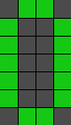
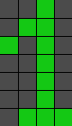
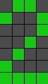
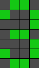
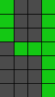
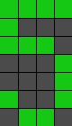
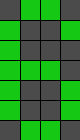
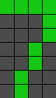
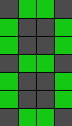
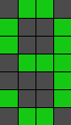

# Project Title

Canvas Number

## Description

This is a simple program that allows you to use a 4 by 7 grid of [nanoleaf canvas](https://nanoleaf.me/en-US/products/nanoleaf-canvas/get-started/) tiles as a display. Specifically it allows you to display the numbers 0 through 9.

The tiles will appear as the following:

## Getting Started

### Dependencies

* run `pip install -r requirements.txt`

### Executing program

To run a simple example app displaying the numbers 0 through 9 

* assign you a static IP on your network
* get an auth token for your canvas. Instructions can be found in the [nanoleaf docs](https://documenter.getpostman.com/view/1559645/RW1gEcCH#f7b37c20-37bb-48b1-93e1-13a79f9bcb34).
* set the SERVER_IP and AUTH_TOKEN global in canvas.py (janky I know).
* run `python main.py`

